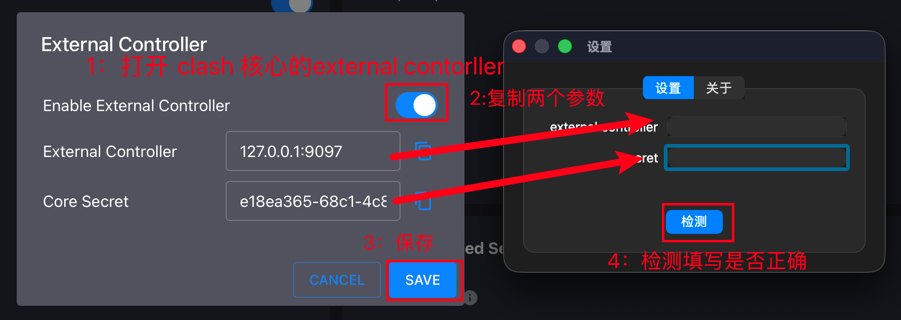
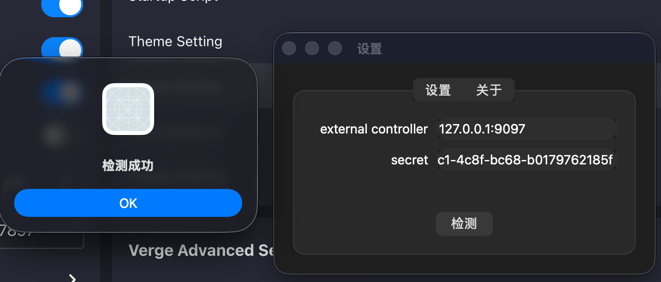

## HearthStone-Skipper 炉石传说 酒馆战旗 MacOS 一键拔线工具

- 通过点击系统栏快速拔线，帮助您快速跳过战斗动画，获取更多操作时间
- 利用 clash 核心的能力，系统影响最小化，需要更少权限
- 自由开源，更加安全

## 如何使用

- 在 release 中下载 app，解压移动到 Application 并打开
- skipper 需要获取 clash 核心的`external_controller`和`secret`，并且需要 clash 核心接管炉石传说客户端的流量  
  skipper 会尝试自动推断`external_controller`和`secret`，如果无法推断，请手动填写

  
  
  
  

## 原理

### 拔线是什么

每句对战中，所有玩家每三分钟同时进入战斗，战斗结束后、直到下次对战的时间被称为回合内。然而每次战斗的过程和结果在进入战斗时已经由服务器确定，客户端只是播放动画。

拔线指通过特殊手段跳过战斗动画，提前结束战斗进入回合，获得更多操作时间

### 拔线的原理

在战斗时或战斗即将开始时，断开客户端与服务器的连接，使客户端自动尝试重连，重连完成后即可跳过战斗动画，提前进入回合

### 本项目的独特之处/契机

由于 macOS 新内核去除了 ALTQ，过去基于 packet filter 阻塞炉石传说客户端联网的方法已经失效  
同时，作为替代，新引入的 firewall 没有提供阻塞出站流量的方法。要实现暂时阻塞炉石传说客户端的出站流量，只能依靠预安装某些Network
Extension

然而，这些软件要么支持的功能不足以动态添加规则、终止一个活跃的网络连接，要么是商业付费专有的

本项目使用了一个独特的思路，通过external controller与 clash 核心通信，在 clash 核心内终止炉石传说客户端连接，因此不需要
root 权限，不修改网络配置，系统影响小

同时，这个思路也适用于 windows 端的炉石传说客户端。虽然 windows 端已有广泛使用的 HDT炉石团子
插件，但需要管理员权限，而且由开源转为闭源，严重违反开源精神

## 要求

1. 您使用的 clash 核心需要能够接管炉石传说客户端的流量
2. MacOS（我没有使用任何平台特定功能，略加修改即可运行在 windows）

