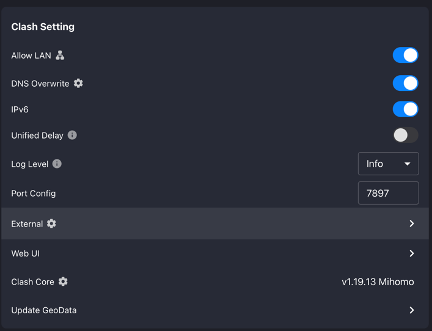
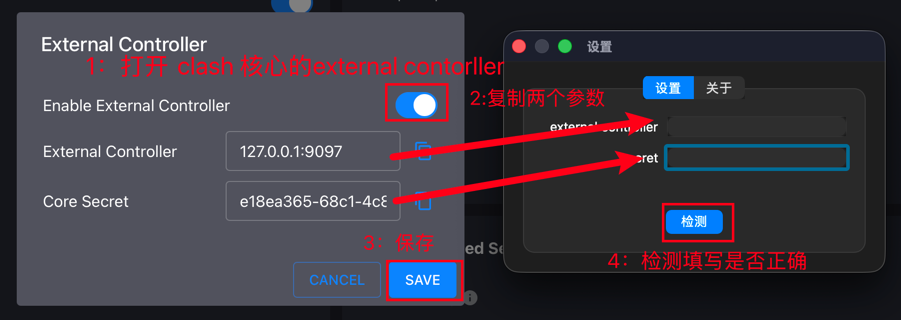
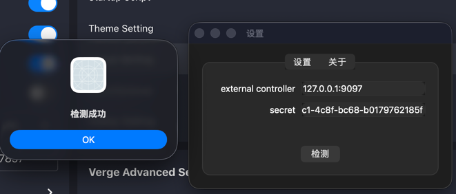
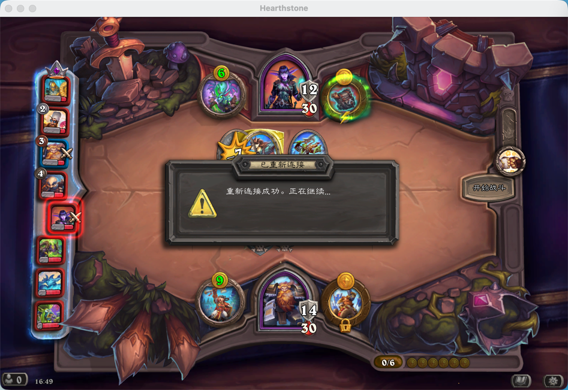

## HearthStone-Skipper 炉石传说 酒馆战旗 MacOS 一键拔线工具

- 通过点击系统栏快速拔线，帮助您快速跳过战斗动画，获取更多操作时间
- 可选择 Clash/Mihomo 后端，或完全不依赖 Clash 的 macOS 原生 PF 后端
- 自由开源，更加安全

## 如何使用

- 在 release 中下载 app，解压移动到 Application 并打开
- 在设置的“拔线后端”中选择一种方式：
  - `macOS 原生 PF（无需 Clash）`：先关闭 Clash/VPN 的 TUN；每次启动通常只需按系统提示授权一次；
  - Clash TCP/IP 或 UNIX 套接字：需要核心接管炉石流量，并配置控制器。
- 使用 Clash 后端时，skipper 需要获取 clash 核心的`external_controller`和`secret`，并且需要 clash 核心接管炉石传说客户端的流量。
  skipper 会尝试自动推断`external_controller`和`secret`，如果无法推断，请手动填写
- 开启 clash 的 tun 模式（或者 clash x pro 的增强模式），保证 clash 核心能够接管到炉石传说客户端的流量
- 在 clash 配置文件的末尾添加`find-process-mode: always`，保证 clash 核心解析连接发起进程，帮助 skipper 找到炉石传说客户端与对局服务器的连接

  
  
  
  
  
  
  

## 原理

### 拔线是什么

每句对战中，所有玩家每三分钟同时进入战斗，战斗结束后、直到下次对战的时间被称为回合内。然而每次战斗的过程和结果在进入战斗时已经由服务器确定，客户端只是播放动画。

拔线指通过特殊手段跳过战斗动画，提前结束战斗进入回合，获得更多操作时间

### 拔线的原理

在战斗时或战斗即将开始时，断开客户端与服务器的连接，使客户端自动尝试重连，重连完成后即可跳过战斗动画，提前进入回合

### 本项目的独特之处/契机

macOS 已移除 ALTQ，但 PF 的过滤与连接状态控制仍然存在。真正的限制是：macOS 应用防火墙没有提供按应用终止活跃出站连接的公开接口；PF 需要 root 权限、不按进程识别连接，而且仅加载新规则不会自动清除已有连接状态。若要安全集成，还需要签名的特权 helper 或 Network Extension。

然而，这些软件要么支持的功能不足以动态添加规则、终止一个活跃的网络连接，要么是商业付费专有的

本项目使用了一个独特的思路，通过external controller与 clash 核心通信，在 clash 核心内终止炉石传说客户端连接，因此不需要
root 权限，不修改网络配置，系统影响小

macOS 原生后端通过炉石日志与 `libproc` 双重确认真实对局连接，再由受限辅助程序在独立 PF anchor 中短暂加载精确规则并清除对应状态；完成或失败后都会撤销规则。它不依赖 Clash，但需要 macOS 管理员授权。详细设计和边界见 [非 Clash 原生拔线方案](docs/native-disconnect-design.md)。

同时，这个思路也适用于 windows 端的炉石传说客户端。虽然 windows 端已有广泛使用的 HDT炉石团子
插件，但需要管理员权限，而且由开源转为闭源，严重违反开源精神

## 要求

1. 原生 PF 后端要求 macOS，并需要管理员授权
2. Clash 后端要求兼容 Clash API 的核心能够接管炉石传说客户端流量
